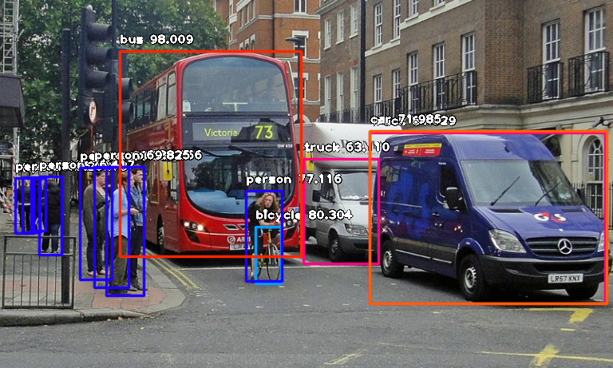
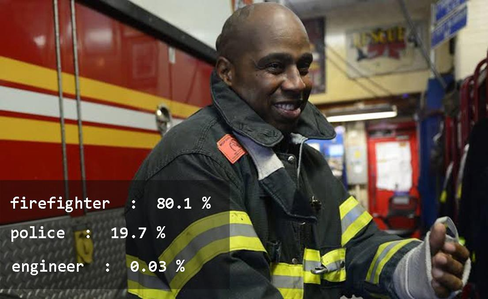

# Opticon

Problem Statement

---
Contraband sexually explicit digital media, specifically featuring minors, is proliferating all over the internet on social media and cloud storage sites, such as twitter, tumblr and dropbox, google plus, etc. Current efforts have been not fully effective in curbing the storage and distribution of these files. The current approach using file hashing is an effective solution to avoiding potential privacy violations for users but will only function by matching previously known files through exact file hash matching. By evaluating the hashes of individual data blocks, rather than the hashes of entire files there has been some improvement to this [technique](https://www.sciencedirect.com/science/article/pii/S1742287615000468) but it continues to have poor sensitivity. Thus new contraband and older significantly altered files (changing file type or editing material's dimensions or length) are very likely to evade these current hash-based detection systems, thus necessitating heavy reliance on [human powered detection which is slow, costly, and psychologically burdensome to human content monitors](https://www.wnycstudios.org/story/post-no-evil).

Proposed Solution

---
Artifical intelligence using deep learning models and computer vision programs have come of age and are rapidly increasing in effective pattern matching. By leveraging these new technologies and their ability to learn and apply adaptive criteria when analyzing data, it is feasible that an A.I. could be trained to understand the definition of illegal imagery using systematic factors. Using machine-based adapative pattern-matching would allow for detection of new, previously undiscovered material as well increased sensitivity to previously identified files at scale and at more efficient rates without exposing private information to human actors.

Proof of Concept - Computer Vision

---
Open-source computer vision coding libraries, such as ImageAI https://github.com/OlafenwaMoses/ImageAI, can be rapidly fine-tuned to harness machine image detection capabilities for both objects and subjective human characteristics of interest.

When new, previously unseen images are processed through AIs that have been 'trained' on large data sets of known images they can apply statitical models to recognize and analyze image content. For example, before processing this image of a bus stop below appears like so:


After being analyzed by a trained program for object detection the return output appears as so:



[Source](https://towardsdatascience.com/object-detection-with-10-lines-of-code-d6cb4d86f606)

---

Additional examples showing classification of human subjects by context such as dress and environment:


```python
waiter  :  99.99997615814209
chef  :  1.568847380895022e-05
judge  :  1.0255866556008186e-05
```



[Source](https://towardsdatascience.com/train-image-recognition-ai-with-5-lines-of-code-8ed0bdd8d9ba)

As demonstrated above, image detection is indeed approaching human abilities.  In the current method, AI programs are given large data sets (10,000 images) of preprocessed files that show variations of a given predefined image queries, e.g. table, kitten, or apple. After being iteratively tested, re-tuned, and re-tested artificial neural networks are said to become "trained." When these trained AIs are subsequently presented with novel images, they are able to produce reliable statistical outputs of the likelihood that such images contain the given image queries. 

The question then becomes how to leverage this ability to specifically detect contraband explicit images with minors. One way would be to train the AIs on data sets of known contraband images. However this is problematic for obvious reasons, namely the illegal nature of these images. My hypothesis is that you would not need known contraband images for a training dataset. Instead using completely legal images that could train criteria that abstract out the definition of contraband images you could circumvent this problem and still acheive reliable detection. For example, querying image subject's age, relative percentage of exposed skin, proximity of adult explicit content, e.g. adult genitalia. Thus my proposal would be to train separate criteria that would all be present in an illegal contraband image and by summation statistics generate an effective probablity threshold for flagging illegal content.

---

Additional Approaches

Web page scanning techonologies similar to that used by search engines could be coupled with the visual modalities of deep machine learning and arftifical neural netowrks. This coupling could hypothetically increase the detection sensitivity for a given search query. For instance, IBM's Watson--an advanced natural language AI that won Jeopardy several years ago--offers us the ability to use its [abilities to analyze emotional sentiment in text content](https://www.ibm.com/watson/services/tone-analyzer/). Simple [word clouding applications](https://www.wordclouds.com/) give us a good visual of an AI's abilities to apply anaylsis criteria to the type and frequency of words in the content of a file or given web page.

Therefore, by using known identifying linguistic elements that are found on pages where illegal content is likely to be distributed, computer programs that 'crawl' through all the content on web pages could identify likely targets through text anaylsis and then deploy image detection to to search for contraband files. This combination could become a hunt and seek tool that would serve techonology hosting firms and government agencies with their illegal content detection goals.

Proposed Plan
---
---

Given the feasbility of this apporach, I propose that I self-finance and drive the creation of a machine-learning AI contraband detection tool, dubbed Opticon, that will I develop. Once tested and usable, it could be used by partners to improve filtering, monitoring, and appropriate reporting of contraband files.

### Stage one: Development of trained Artifical Neural Network

- [x] Research existing computer vision libraries
- [ ] Build example data set testing model based on selected library's specifications
- [ ] Develop targeted data sets for Opticon's training strategy

#### Timeline: 1 to 3 months

### Stage two: Partner with a social media company to for testing

- [ ] Select best integration target based upon methods available in application public interface (API) from possible test companies
- [ ] Learn the selected API
- [ ] Build Opticon's architecture in python and javascript and integrate target social media company's API data into the system and test returned data. Data created by the system would be probability vectors that highlight statistically likely contraband files and map network distribution patterns on the social media to generate a list of source users and suspect files with associated probabilities.
- [ ] Create user dashboard to visualize this data, specifically that highlights potential hotspots of contraband file activities and makes for easy of follow up from partner company and data collection for necessary reporting to appropriate authorities.
- [ ] Identify potential industry point person at target company
- [ ] Create a proposal for point person's benefit and initiate contact

#### Timeline: 1 month

### Stage three: Disseminate Opticon Content Moderation system

- [ ] Build an public API lbirary for the AI detection system cloud-based application in order to facilitate dissemination of the detection tool capabilities to additional partners, including portal and interface for approriate governmental authorities.
- [ ] Present tool at tech conference and to strategic tech media partners in order to generate interest and new partnerships
- [ ] Create a 501-c-3 organizational structure and team up with motivated partners to expand capabilities and reach of the detection tool.

#### Timeline: 6 months to 1-2 years